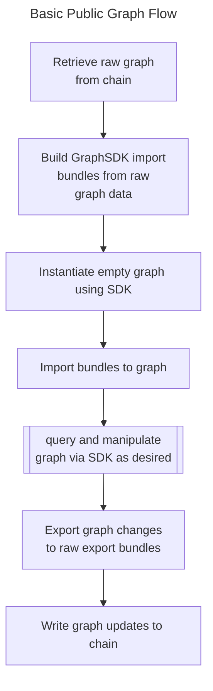
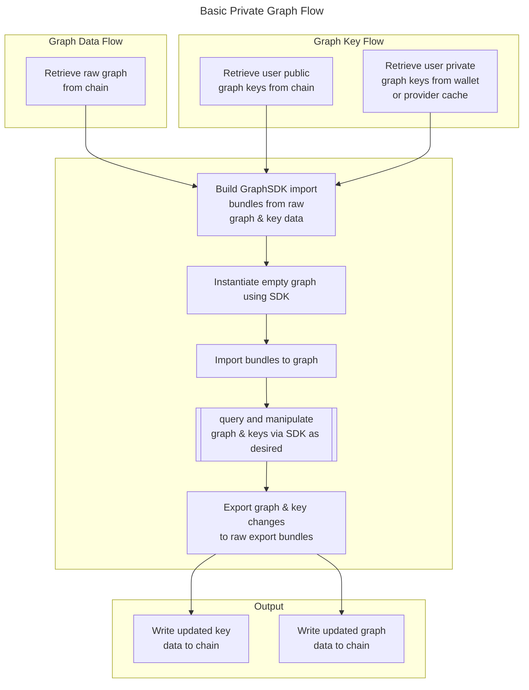

```mermaid
---
title: "Basic Public Graph Flow"
---
flowchart TD
    A[Retrieve raw graph\nfrom chain] --> B[Build GraphSDK import\nbundles from raw\ngraph data]
    B --> B'[Instantiate empty graph using SDK]
    B' --> C[Import bundles to graph]
    C --> D[[query and manipulate\ngraph via SDK as desired]]
    D --> E[Export graph changes\nto raw export bundles]
    E --> F[Write graph updates to chain]
```

```mermaid
---
title: "Basic Private Graph Flow"
---
flowchart TD
    subgraph Graph Key Flow
    A1[Retrieve user public\ngraph keys from chain]
    B1[Retrieve user private\ngraph keys from wallet\nor provider cache]
    end
    subgraph Graph Data Flow
    A2[Retrieve raw graph\nfrom chain]
    end
    subgraph \n
    B[Build GraphSDK import\nbundles from raw\ngraph & key data]
    A2 --> B
    A1 & B1 --> B
    B --> B'[Instantiate empty graph using SDK]
    B' --> C[Import bundles to graph]
    C --> D[[query and manipulate\ngraph & keys via SDK as desired]]
    D --> E[Export graph & key changes\nto raw export bundles]
    end
    subgraph Output
    A3[Write updated key\ndata to chain]
    B3[Write updated graph\ndata to chain]
    E --> A3 & B3
    end
```
